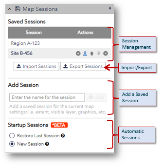

# Map Sessions

## Introduction

The Save Session tool allows users to save the current map settings into a session and restore them again later. A saved session includes the extent, visible layers, and graphics (markup) of the current map. Sessions may be saved and loaded from files so they can be shared with others. Users can also enable startup Sessions to automatically restore their session when returning to the site.

## Capabilities

- __Add Session__ - Users enter a name in the _Name:_ text area used to identify the session and click the [ Save ] button to create a saved session.

- __Import Sessions__ - Users click the [Import Sessions] button to load sessions from an exported sessions file.

- __Export Sessions__ - Users click the [Export Sessions] button to export their a sessions to a file that can be shared with others or restored at another time.

- __Manage Sessions__ - The following tools provide users with the ability to manage individual saved sessions. When a user hovers their mouse over a session item in the _Session Management_ section, action buttons are displayed for the session.

	- __Load__ - the [ <i class="fa fa-plus-circle"/> Load ] action is used to restore the map settings from the saved session.

	- __Download__ - the [ <i class="fa fa-download"/> Download ] action is used to export the saved session as a file that can be shared with others or restored at another time.

	- __Move Up__ - the [ <i class="fa fa-arrow-up" style="font-size:x-small"/> Move Up ] action is used to move the saved session up in the session management area list.

	- __Move Down__ - the [ <i class="fa fa-arrow-down" style="font-size:x-small"/> Move Down ] action is used to move the saved session down in the session management area list.

	- __Delete__ - the [ <i class="fa fa-times-circle"/> Delete ] action is remove a saved session from the session management area list.

- __Startup Sessions__ *BETA - Users can enable startup Sessions to automatically restore their session when returning to the site.

	- __Restore Last Session__ - Restored sessions will use the extent, visible layers, graphics, etc. from your last visit when loading the site.

	- __New Session__ - New sessions will use the site defaults when loading the site.
